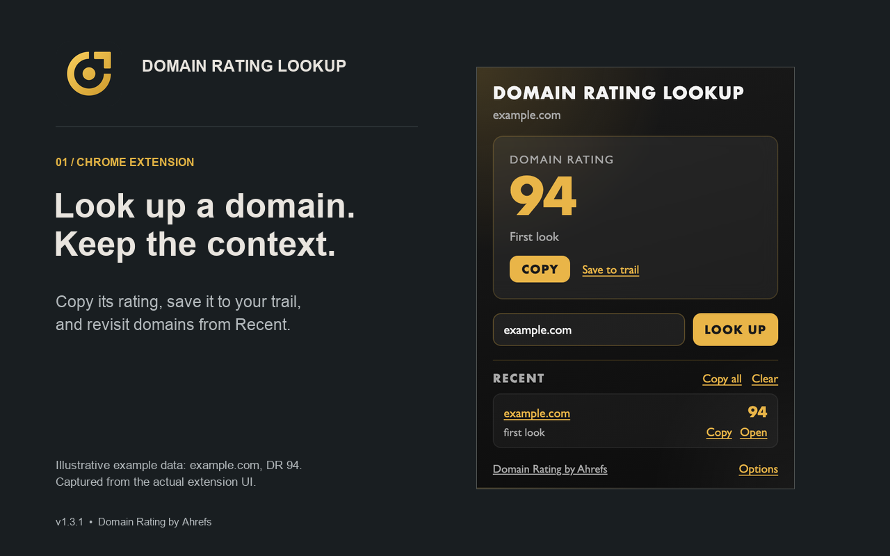
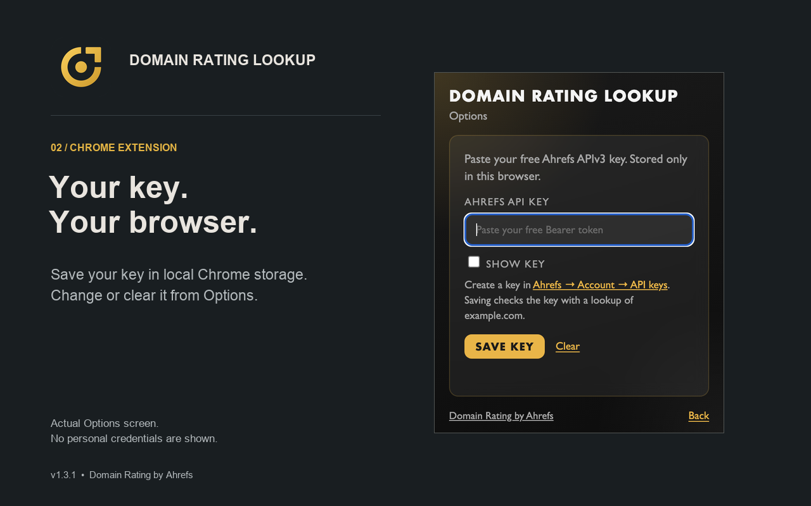
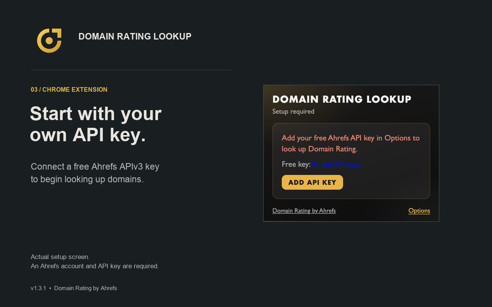

# Domain Rating Lookup


Chrome extension that shows **Ahrefs Domain Rating** for the site in your active tab. Uses the free [`domain-rating-free`](https://docs.ahrefs.com/en/api/reference/public/get-domain-rating-free) API, with a toolbar badge, popup, and a local prospecting trail.

<br clear="all" />

<div align="center">
  
  <p><strong>v1.3.0</strong> · <a href="https://github.com/snowopsdev/dr-extension">GitHub</a> · <a href="https://chromewebstore.google.com/detail/domain-rating-lookup/bmhkggondppljacnlenomikfogbppidc">Chrome Web Store download</a></p>
</div>

---

## Screenshots

| Rating popup | Options (in popup) | Setup |
| --- | --- | --- |
|  |  |  |

## Features

- **Toolbar badge** — Domain Rating for the current http(s) site (active tab only)
- **Popup** — large rating, score delta since last saved look, one-click copy (`example.com — DR 94`)
- **Look up a domain** — paste a hostname without visiting it
- **Recent trail** — local list of domains you explicitly looked up (popup, Save to trail, or paste), with Copy all (TSV) and Open
- **In-popup Options** — paste your free Ahrefs APIv3 key; Save checks the key before storing it
- **Privacy-minded** — no analytics; key and trail stay local; lookups go only to Ahrefs; browsing does not fill the trail

## Install

### From the release zip

1. Download [`domain-rating-lookup.zip`](https://github.com/snowopsdev/dr-extension/releases/latest/download/domain-rating-lookup.zip)
2. Unzip it
3. Open `chrome://extensions` → enable **Developer mode** → **Load unpacked**
4. Select the unzipped folder
5. Click the toolbar icon → **Options** → paste a free key from [Ahrefs → API keys](https://app.ahrefs.com/account/api)

### From this repo (dev)

1. Clone the repo
2. Load the repository root as an unpacked extension (folder with `manifest.json`)
3. Add your Ahrefs key in the popup Options screen

## How to use

1. Visit any http or https page
2. Read Domain Rating on the toolbar badge
3. Click the icon for details, copy, Save to trail, and your recent list
4. Paste a domain in the popup to look it up without opening the site
5. Open **Options** inside the popup anytime to change or clear your key

The toolbar may cache a score for about an hour so the badge can update as you switch tabs. That cache is not the Recent trail. The trail only grows when you open the popup on a site, click **Save to trail**, or look up a pasted domain.

## Privacy

See [`store/PRIVACY.md`](store/PRIVACY.md) or the hosted policy:  
https://gist.github.com/snowopsdev/8ce34b2d81c64daa4bb0d1f331650297

Your API key and Domain Rating trail are stored in Chrome local storage on this browser only. Hostnames are sent to Ahrefs only when looking up Domain Rating (active-tab badge, popup, pasted domain, or a one-time example.com check when you save a key). The Recent trail is not a browsing log.

## Attribution

Domain Rating by [Ahrefs](http://ahrefs.com/legal/domain-rating-license). Use is subject to the Domain Rating License.

## Develop

```bash
npm test
npm run smoke                       # expected auth failure without a key
AHREFS_API_KEY=… npm run smoke      # live success path
npm run screenshots                 # regenerate store/screenshots
npm run package                     # writes dist/domain-rating-lookup.zip
npm run prove                       # CDP load-unpacked smoke
```

Store listing source of truth: [`CHROMEWEBSTORE.md`](CHROMEWEBSTORE.md)

## License

This extension’s source is provided as-is for the Domain Rating Lookup project. Ahrefs Domain Rating data remains subject to Ahrefs’ terms and the Domain Rating License.
